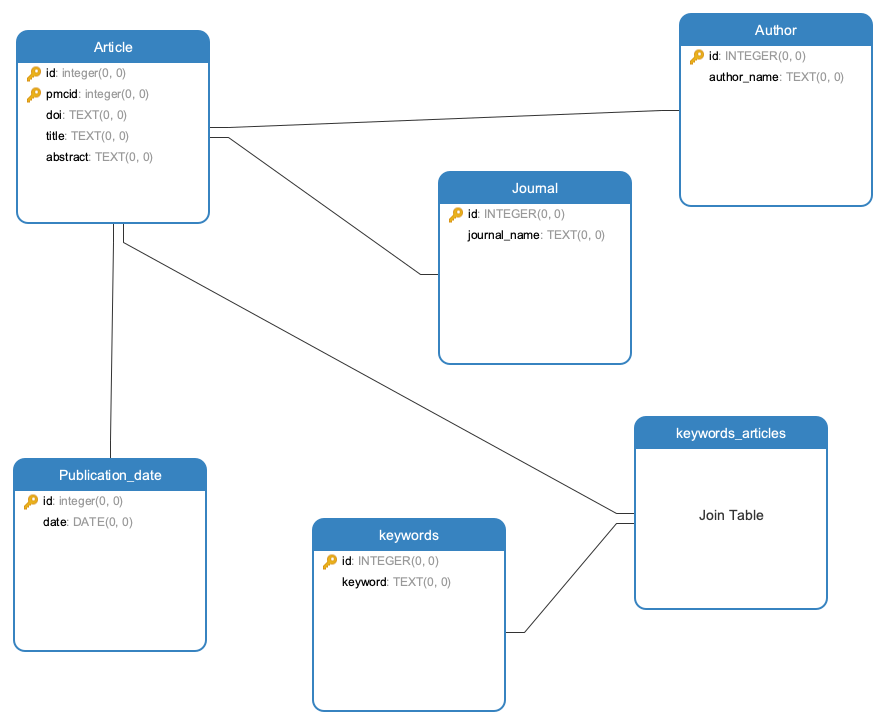

# SQLITE Mini Project

L'objectif de ce TP est d'aborder l'API PubMed et de réaliser des requêtes SQL complexes sur les données récupérées.

We want to have a first introduction to the PubMed API and make some SQL queries on the collected data turned into tables.

## First Step : Consume PubMed API to fetch data

We fetch 1000 articles dealing with genetics on PubMed website.

We needed 2 steps to get the data :
- fetch the ids (PMCID) of the targeted articles 
- for each PMCID, collect the title, abstract, pubmed_id, publication date, keywords, journal, doi and first author. 

The code consuming the API can be found in **src/app.py**.

## Second Step : Data normalization

With Pandas library, we separated the data collected to create our database **data/pubmed.db**.

The code normalizing the data can be found in **src/normalize_data.py**.

Below the physical model for our database.

## Third step : SQL queries

We decided to extract the following data:

- abstracts by authors being published more than twice
- journal ranking by number of publications
- number of articles published by year

The query results were saved in the **data** folder.

You can also execute the **src/save_query_results.sh** to fetch the data again.

The standalone SQL queries are also in the **src/script_pubmed.sql**.
