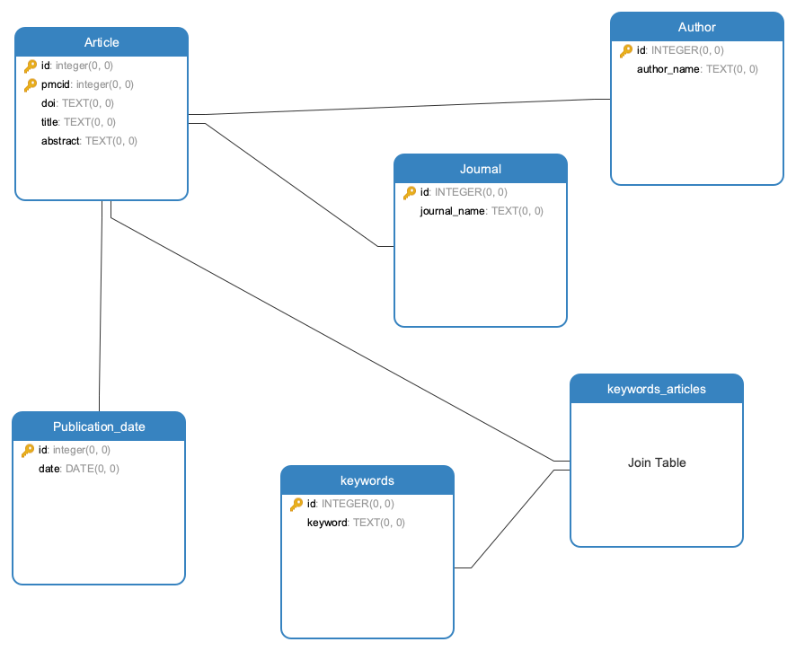

# Mini projet

L'objectif de ce TP est d'aborder l'API PubMed et de réaliser des requêtes SQL complexes sur les données récupérées.

## Première étape : Récupération des données

On récupère les 1000 articles les plus pertinents en Génétique sur le site PubMed. 
Les requêtes ont permis dans un premier temps de récupérer les id (PMCID) des articles de recherche. Ces ids ont ensuite permis la requête des metadata des articles associés : titre, extrait, pubmed_id, date de publication, mots-clés, journal de publication, doi et le premier auteur.

Le code associé est dans le fichier **app.py**.

## Deuxième étape : Normalisation des données

Avec Pandas, on sépare les données pour les intégrer dans notre future base de données **pubmed.db**.
Le code associé est le fichier **normalize_data.py**.

## Troisième étape : Requêtes sur la base de données

- Récupération des extraits des auteurs ayant au moins publié deux fois.
- Réaliser un classement des journaux scientifiques par rapport au nombre de publications
- Récupération du nombre d'articles publiés par an

Les résultats sont sauvegardés dans les fichiers **authors_extracts.csv, classement_journals.csv and articles_year.csv**.

Les requêtes SQL sont dans le script **script_pubmed.sql**.
